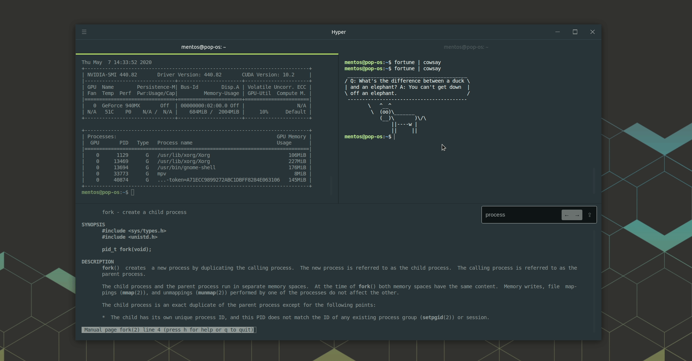

# dotfiles
My system customization
### Installation
#### Gnome
Gnome configuration is handling by [dconf](https://wiki.gnome.org/Projects/dconf). 
```bash
$ ./dump.sh #IMPORTANT: is better run this first in order to get a backup of your current configuration.
$ ./install.sh gnome_settings #or gnome_settings.backup if you want to restore previous configuration. 
```

#### Hyper

In order to import my custom Hyper settings (as keywords, theme, plugins) is enough run in **dotfiles/hyper**:
```bash
$ ./import.sh
```

#### VS Codium
To maintain this configuration easier, I've used [code-settings-sync](https://marketplace.visualstudio.com/items?itemName=Shan.code-settings-sync) extension. In order to apply this one, a [Github Access Token](https://help.github.com/en/github/authenticating-to-github/creating-a-personal-access-token-for-the-command-line) is required, then launch this in **dotfiles/vscodium**:
```bash

$ ./install.sh <your_access_token>
```
When the execution will be finish, open VSCodium and wait the full installation.
